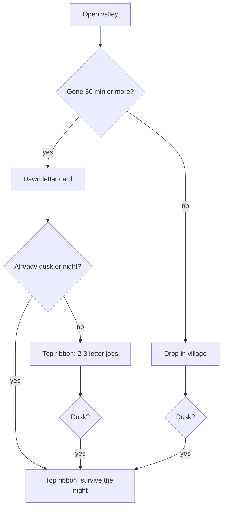

# Shalom Valley Daily Bread - Plan

## Goal Capsule

- **Objective:** Make coming back to Shalom Valley a short ritual: a dawn letter after a real absence, then a living 2–3 job ribbon, then a dusk takeover of that same ribbon.
- **Product authority:** This plan owns only the Daily Bread habit slice. Share cards, graphics glow-up, Founder's Blessing / cloud save, and the named-souls story book are not active scope.
- **Open blockers:** None.

---

## Product Contract

### Summary

When a returning player has been gone 30 minutes or more, one short dawn letter pops once, then a top ribbon offers 2–3 jobs that match that letter. Jobs check off as they are done. Near night the ribbon turns warning-red and the jobs become survive-the-night. A refresh or a peek under 30 minutes drops the player in the village with no letter.

### Problem Frame

Phase 1 already applies away progress and can show a numbers-only "While you were away" card after 10 minutes, plus a dusk toast 30 seconds before night. Coming back feels like a ledger, not a letter, and landing in the village has no "do this next." The player who opens the tab tomorrow has no ritual that makes the return obvious and good.

### Key Decisions

- **Habit first.** (session-settled: user-directed — chosen over share, feel, money, and souls as the first ship: return tomorrow before anything else.) Product authority; no governed R.
- **Letter pops once, then one ribbon.** (session-settled: user-directed — chosen over three-popup stack and over walk-to-a-scroll: letter is the return beat, ribbon is the play beat.) Governs R1, R6, R11.
- **Letter only after a real absence.** (session-settled: user-directed — chosen over every-open and once-per-calendar-day: a peek must not interrupt.) Governs R4, R5.
- **Letter is story + voice + ledger on one card.** (session-settled: user-directed — chosen over ledger-only or story-only: one card, not three screens.) Governs R2.
- **Full Daily Bread, not letter-only.** (session-settled: user-directed — chosen over letter-only and letter+dusk-without-jobs: habit needs the next action.) Governs R6, R11.
- **Jobs are a 2–3 item checklist the player picks from.** (session-settled: user-directed — chosen over one forced job and over world-glow-only: player chooses order.) Governs R7.
- **Jobs come from the letter.** (session-settled: user-directed — chosen over generic rules and danger-first: the note authors the day's work.) Governs R8.
- **Ribbon is living and dusk-swaps.** (session-settled: user-directed — chosen over a static list and over red-tint-without-swap: dusk is a new job set, not a sticker.) Governs R9, R11.
- **Visit-first-name, not souls.** A first name may appear in the letter so a job can point at someone. That is not persistent memory, wants, or the Book of the Valley. Governs R3.

<!-- ce-section: work-relationships -->
### How This Work Fits Together

This plan owns **Daily Bread** (letter, living job ribbon, dusk takeover). The broader Shalom Valley evolution below is the current understanding, not a committed roadmap.

- Share (Valley Card, OG image, public valley URL)
  - Depends on a return moment worth posting; can proceed independently of this plan's ribbon internals
- Feel (camera, walk cycles, screenshot mode)
  - Can proceed independently of Daily Bread
- Money (Founder's Blessing, cloud save, cosmetics)
  - Can proceed independently; cloud save is the first paid unlock when that plan exists
- Souls (named villagers with memory, dawn book, Exodus)
  - Shares the visit-first-name seam in R3; still to decide how a later souls plan replaces visit names

### Actors

- A1. Returning player — the person who already has a valley and opens the tab again.
- A2. Valley — the game systems that apply away progress, write the letter, pick jobs, and watch dusk.

### Requirements

**Letter**

- R1. After a qualifying absence, show exactly one dawn-letter card over the village before play continues.
- R2. That card holds three layers in this order: one story line about what happened while gone, one line in a valley voice, then the away numbers (time gone, crops ripened, rent).
- R3. The voice and story may use a first name bound to a living villager for this visit only. If no villager exists, the valley itself speaks. Names do not persist as a souls system.
- R4. A qualifying absence is 30 minutes or more of real time since the last save. Shorter absences apply silent away progress and show no letter.
- R5. A refresh or a tab peek under 30 minutes drops the player in the village with no letter.

**Ribbon and jobs**

- R6. Closing the letter reveals a top ribbon with 2–3 jobs for this visit.
- R7. The jobs are a checklist. The player may do them in any order. The game does not force a sequence.
- R8. Each job matches a beat in that letter. If the letter is too thin to author three beats, fill remaining slots with pray / walk the dark edge / stand at the altar so the ribbon is never empty after a letter.
- R9. When the player completes a job, its box checks off on the ribbon during this visit.
- R10. If this visit had no letter, do not show a job ribbon. Dusk (R11) may still take the ribbon.

**Dusk**

- R11. When in-game dusk hits (30 seconds before night), the ribbon turns warning-red and its jobs become 2–3 survive-the-night tasks. It does not keep the day list underneath a red tint.
- R12. Do not also show the existing dusk toast when the ribbon is visible. The ribbon is the dusk warning.
- R13. If the player returns and it is already dusk or night, show the letter first when R1 applies, then show the ribbon already in the R11 dusk state.

**Session**

- R14. The letter pauses the world until dismissed, same as today's away card.
- R15. Away progress still caps at 8 hours and still has no raids while gone. The letter reports that cap; it does not invent combat that did not happen.

### Key Flows

- F1. Qualifying return
  - **Trigger:** A1 opens the valley after ≥30 minutes away.
  - **Actors:** A1, A2
  - **Steps:** A2 applies capped away progress. Letter card appears with story, voice, numbers. A1 dismisses it. Ribbon shows 2–3 letter-matched jobs.
  - **Covered by:** R1, R2, R4, R6, R8, R14, R15
- F2. Short peek
  - **Trigger:** A1 opens the valley after less than 30 minutes.
  - **Actors:** A1, A2
  - **Steps:** Silent away progress if any. No letter. No job ribbon. Play starts in the village.
  - **Covered by:** R5, R10
- F3. Living checklist
  - **Trigger:** A1 completes a ribbon job during the day.
  - **Actors:** A1, A2
  - **Steps:** The matching box checks off. Remaining jobs stay. Order is the player's.
  - **Covered by:** R7, R9
- F4. Dusk takeover
  - **Trigger:** In-game clock reaches 30 seconds before night while the ribbon is up, or dusk arrives on a no-letter visit.
  - **Actors:** A1, A2
  - **Steps:** Ribbon turns warning-red. Jobs swap to survive-the-night. No separate dusk toast.
  - **Covered by:** R10, R11, R12
- F5. Return into night
  - **Trigger:** A1 qualifies for a letter and the saved clock is already dusk or night.
  - **Actors:** A1, A2
  - **Steps:** Letter first. On dismiss, ribbon is already in dusk state.
  - **Covered by:** R13

### Acceptance Examples

- AE1. Overnight return
  - **Covers R1, R2, R4, R6.**
  - **Given:** Last save was 3 hours ago, crops ripened, a villager exists.
  - **When:** A1 opens the valley.
  - **Then:** One letter card shows a story line, a named voice line, and the numbers. Dismissing it shows a top ribbon with 2–3 jobs that match the letter.
- AE2. Refresh
  - **Covers R5, R10.**
  - **Given:** A1 saved 2 minutes ago.
  - **When:** A1 reloads the page.
  - **Then:** No letter. No job ribbon. The village is playable immediately.
- AE3. Coffee-break absence
  - **Covers R4, R5, R15.**
  - **Given:** A1 was gone 12 minutes. A crop finished growing.
  - **When:** A1 returns.
  - **Then:** The crop is ripe. No letter appears.
- AE4. Empty village letter
  - **Covers R3, R8.**
  - **Given:** Qualifying absence, zero villagers, at least one ripe farm.
  - **When:** The letter shows.
  - **Then:** The valley speaks with no first name. Jobs still fill to 2–3, including harvest if the letter mentioned the farm.
- AE5. Job checkoff
  - **Covers R7, R9.**
  - **Given:** Ribbon shows Harvest wheat, Pray at the altar, Check the north wall.
  - **When:** A1 prays at the altar first.
  - **Then:** Only Pray checks off. The other two remain.
- AE6. Dusk swap
  - **Covers R11, R12.**
  - **Given:** Day ribbon is visible.
  - **When:** Dusk hits.
  - **Then:** Ribbon is warning-red with survive-the-night jobs only. No dusk toast.
- AE7. Letter into night
  - **Covers R13, R14.**
  - **Given:** Qualifying absence. Saved clock is night.
  - **When:** A1 opens the valley.
  - **Then:** Letter appears and the world is paused. After dismiss, the ribbon is already dusk.

### Success Criteria

- A1 can close the letter and know what to do in under a minute without opening a menu.
- A refresh never shows the letter.
- The dusk warning lives in one place, not a toast plus a ribbon.

### Scope Boundaries

**Deferred for later**

- Valley Card, share-to-X, public valley URL, OG images
- Camera, walk cycles, dawn color grade, HUD-off screenshot mode
- Founder's Blessing, cloud save, cosmetics, a store
- Named villagers with memory, the Book of the Valley, Exodus prestige
- Touch controls, visit-a-friend, leaderboards, in-valley ads

**Outside this product's identity**

- Energy gates, pay-to-pray, pay-to-cleanse-sin, gacha relics
- Live multiplayer or PvP
- Treating a real-world religion as an enemy

### Dependencies / Assumptions

- Away progress, the current away card, and the dusk toast already exist. This work replaces the card's voice and moves dusk warning onto the ribbon.
- First player is the site owner. No live-player evidence yet.
- "Gone" uses the same real-time-since-last-save clock as today's away report, with the threshold raised from 10 minutes to 30.

### Outstanding Questions

**Deferred to Planning**

- The visit-name list and how a name binds to a living villager sprite for one visit.
- The survive-the-night job catalog (2–3 defense-flavored tasks).
- Exact copy bank for story lines and valley voice, matching existing dialogue tone.
- How job completion is detected for each job type.

### Sources / Research

- Current away gate is 600 seconds in `lib/valley/save.ts`; away payload is hours / cropsGrown / rent only.
- Away UI is the "While you were away" modal in `components/valley/valley-game.tsx`.
- Dusk toast fires 30 seconds before night in `lib/valley/scenes/WorldScene.ts`.
- `SavedVillager` has no name field; `{name}` in `lib/valley/dialogue.ts` is the player name.
- Phase 1 out-of-scope list (cloud saves, cosmetics, leaderboards) is in `docs/superpowers/specs/2026-09-12-shalom-valley-phase-1-design.md`.
