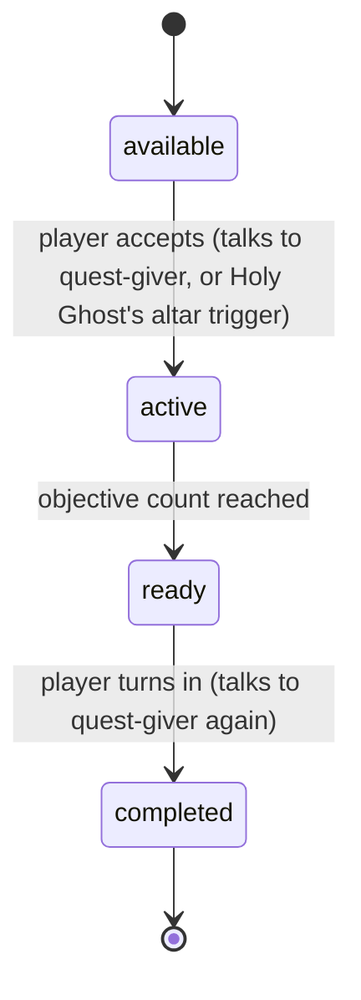

# Shalom Valley Characters & Story - Plan

## Goal Capsule

- **Objective:** Give Shalom Valley a quest-driven cast — five named Big Recruits with their own biblical-story questlines, a roster the player can deploy (follow or station), and a lighter paid tier of scattered NPCs that unlocks as the player levels.
- **Product authority:** This plan owns the Characters & Story area only. Village Sim & Economy, Society & Government, Combat/Gear & Wars, and Divine Judgment & Mysticism — all raised in the same conversation — are not active scope here; see How This Work Fits Together.
- **Open blockers:** None. Every fork raised during dialogue was resolved; remaining open items are tuning-level and listed under Outstanding Questions as Deferred to Planning.

## Product Contract

### Summary

Five named characters — Moses, David, Paul, Noah, and the Holy Ghost — each stand in the world as a one-time quest-giver whose own hand-written questline echoes their biblical story. Completing a questline recruits that character permanently and flips one unlock hook (a weapon, building, ability, or — for David, whose questline is Goliath — the game's first boss-fight hook). Recruited Big Recruits join a roster panel where the player sends them to follow or to hold a station, and they can never fall, be lured, or convert. A separate, lighter tier of paid "scattered" NPCs unlocks as the player's own level rises, sharing the same roster mechanics but staying as vulnerable as ordinary villagers. Quest progress tracks in its own journal panel, kept apart from the existing daily ribbon.

### Problem Frame

Every villager today is anonymous: a `seed`, a `gender`, a `level` (`lib/valley/world/villager.ts:24-32`), and even the name shown in the away-letter is picked fresh from a shared pool each visit and never persisted (`pickVisitName`, `lib/valley/dialogue.ts:172-174`). Nothing in the game currently gives a character a fixed identity, a personal storyline, or a reason for the player to seek them out by name. There is also no quest system of any kind — no quest-giver, no objective tracking, no reward hook. The valley has buildings, crops, and combat, but no cast.

### Key Decisions

- **Hybrid character identity** — a small curated roster of named Big Recruits exists alongside a wider pool of promotable/payable scattered NPCs, rather than picking one model exclusively (session-settled: user-directed — chosen over named-roster-only or promoted-villagers-only: the user wants both a curated hero cast and a path for the general population to gain identity). Governs R1, R10.
- **Big Recruits are quest-gated and permanently exempt from harm; scattered NPCs are paid and stay vulnerable** (session-settled: user-directed — chosen over making both tiers behave identically: mirrors the original framing of "assemble a team by doing sidequest or paying"). Governs R2, R3, R6, R11, R12.
- **Unlock rewards are hooks only, not built content** — recruiting a Big Recruit flips a flag; the actual weapon, building, boss encounter, or ability is separate future work (session-settled: user-approved — chosen over designing the full payoff content now: keeps this plan inside Characters & Story; the deferred Combat/Gear and Village Sim areas own the real content). Governs R4, R5.
- **Roster deployment supports both Follow and Station** for every recruit except the Holy Ghost (session-settled: user-directed — chosen over a follow-only or station-only model). Governs R7, R8, R9.
- **The Holy Ghost has no companion form** — it applies its blessing directly on recruitment with no Follow/Station choice, distinguishing a spiritual unlock from a physical companion (session-settled: user-approved — the agent surfaced this fork in the scoping synthesis and the user did not redirect it). Governs R9.
- **David's questline is Goliath, and Goliath is added to the future boss roster** (session-settled: user-directed — the user named this explicitly when reviewing the unlock mapping, extending the boss list beyond the previously-named Satan/dragon/Baal/Moloch). Governs R4.
- **Quest tracking lives in its own journal, separate from the daily ribbon** (session-settled: user-directed — chosen over folding quest objectives into the existing ribbon: keeps the daily-rhythm surface from Daily Bread focused, and keeps multi-day quest state out of a UI built for single-day jobs). Governs R13, R14.

### How This Work Fits Together
<!-- ce-section: work-relationships -->

This plan owns Characters & Story: the five Big Recruits, their questlines, the roster, and scattered NPCs. The breakdown below is the current understanding of adjacent work from the same conversation, not a committed roadmap — a later brainstorm may revise, split, merge, or discard any of it.

- Combat, Threats & Gear — Enables: the actual weapon content and the Goliath boss encounter this plan's unlock hooks point to (R4, R5) land there.
- Village Sim & Economy — Enables: the building content Noah's unlock hook points to (R4, R5) lands there. Can proceed independently of this plan otherwise — crops, a town hall, and job assignment for ordinary villagers don't depend on recruits existing.
- Society & Government — Can proceed independently of this plan. Still to decide: whether recruited Big Recruits ever participate in law/government mechanics.
- Divine Judgment & Mysticism — Can proceed independently of this plan. Shares: the same biblical-figure theming this plan establishes for the roster.

### Actors

- A1. **Player** — controls the avatar; discovers Big Recruit quest-givers, completes their questlines, pays to recruit scattered NPCs, and manages the roster panel.
- A2. **Big Recruit** — one of Moses, David, Paul, Noah, or the Holy Ghost. Exists in the world (except the Holy Ghost) as a single named NPC with a visible quest marker, offering exactly one questline themed on their own biblical story; becomes a permanent roster member on completion.
- A3. **Scattered NPC candidate** — a named character that becomes payable once the player's level crosses that candidate's threshold; joins the roster on payment, no questline required.

### Requirements

**Big Recruits & Questlines**

- R1. The game ships exactly five named Big Recruits for this slice — Moses, David, Paul, Noah, and the Holy Ghost. Jesus is explicitly excluded from this batch, reserved for a later, likely capstone recruit.
- R2. Each Big Recruit except the Holy Ghost exists in the world as a single named NPC with a visible quest marker, personally offering their own one-time questline themed on their biblical story.
- R3. Completing a Big Recruit's questline recruits that same NPC into the player's roster permanently — the quest-giver and the recruited character are the same entity, not a separate reward character.
- R4. Completing a Big Recruit's questline flips exactly one unlock hook: David → a weapon and the game's first boss-fight encounter node (Goliath); Noah → a building; Moses → an ability; Paul → an ability; Holy Ghost → a passive blessing (applied directly, see R9).
- R5. Unlock hooks recorded by R4 are flags/state only. This plan does not implement the weapon, building, boss encounter, or ability content itself — that is separate future work under the deferred areas in How This Work Fits Together.
- R6. A recruited Big Recruit can never fall, be lured, be hypnotized, or convert — permanently exempt from every affliction state that applies to a regular villager.

**Roster & Deployment**

- R7. A roster panel lists every recruited character — Big Recruit or scattered NPC — and lets the player set each one to Follow (travels with the player) or Station (holds a player-chosen spot in the village).
- R8. A followed character travels with the player and acts according to their role (for example, a combat-capable recruit fights nearby threats); a stationed character acts autonomously at its assigned spot.
- R9. The Holy Ghost has no walking companion form. It never appears as a following or stationed sprite, has no Follow/Station toggle in the roster panel, and its blessing (R4) applies immediately on recruitment.

**Scattered NPCs**

- R10. Beyond the five Big Recruits, a wider pool of named scattered NPC candidates becomes available to recruit as the player's own level increases.
- R11. The player recruits a scattered NPC by paying a coin cost. No questline is required.
- R12. A recruited scattered NPC joins the same roster panel (R7) with the same Follow/Station choice and a small role-appropriate perk, but remains vulnerable to falling, luring, hypnosis, and conversion exactly like a regular villager.

**Quest Tracking**

- R13. A quest journal panel, separate from the existing daily job ribbon, lists in-progress and available Big Recruit questlines and each one's current objective.
- R14. The daily job ribbon (Daily Bread) is unaffected by this feature: it continues to show only ambient daily jobs and never surfaces a Big Recruit questline objective.

### Key Flows

- F1. **Recruiting a Big Recruit**
  - **Trigger:** Player approaches a Big Recruit's quest-marker NPC before that recruit has joined.
  - **Steps:** Player accepts the questline → completes its objective(s) in the world → returns to the same NPC to turn in → the NPC joins the roster with a Follow/Station choice (except the Holy Ghost, per R9) → the mapped unlock hook flips.
  - **Covers:** R2, R3, R4, R6.
- F2. **Recruiting a scattered NPC**
  - **Trigger:** Player's level crosses a candidate's unlock threshold and they open the recruit view.
  - **Steps:** Player pays the coin cost → the NPC joins the roster with a small perk → the NPC remains vulnerable per R12.
  - **Covers:** R10, R11, R12.
- F3. **Assigning Follow or Station**
  - **Trigger:** Player opens the roster panel and selects a recruited character.
  - **Steps:** Player picks Follow or Station (choosing a world spot for Station) → the character's behavior updates immediately.
  - **Covers:** R7, R8, R9.
- F4. **Tracking an in-progress questline**
  - **Trigger:** Player has accepted at least one Big Recruit questline.
  - **Steps:** Player opens the quest journal panel → sees each active questline's current objective, distinct from the daily ribbon.
  - **Covers:** R13, R14.

### Acceptance Examples

- AE1. **Given** the player has not yet talked to David's quest-giver NPC, **when** they approach David in the village, **then** a quest marker is visible and starting dialogue offers the Goliath questline. Covers R2.
- AE2. **Given** the player has completed David's questline, **when** the roster panel is opened, **then** David appears as a Follow/Station option, a weapon-unlock flag and the Goliath boss-encounter hook are both set, and no actual Goliath fight or weapon exists in-world yet. Covers R3, R4, R5.
- AE3. **Given** David has been recruited, **when** a tempter or deceiver targets a villager near David, **then** David is unaffected regardless of proximity — only regular villagers and scattered NPCs can fall. Covers R6.
- AE4. **Given** the Holy Ghost has been recruited, **when** the player opens the roster panel, **then** the Holy Ghost's entry shows no Follow/Station toggle and its blessing is already active. Covers R9.
- AE5. **Given** the player's level has just crossed a scattered-NPC unlock threshold, **when** they open the recruit view, **then** the newly available candidate is listed with its coin cost, and paying it immediately adds them to the roster. Covers R10, R11.
- AE6. **Given** a scattered NPC is stationed at the wall, **when** a robber or tempter attacks nearby, **then** the scattered NPC can be lured, hypnotized, or fall exactly like a regular villager stationed there would. Covers R12.
- AE7. **Given** two Big Recruit questlines are active at once, **when** the player opens the quest journal, **then** both show their current objective, and the daily ribbon at the top still shows only the ambient daily jobs, unaffected. Covers R13, R14.

### Success Criteria

- A player can recruit at least one Big Recruit through natural play — find the NPC, complete the questline, return — without needing external instructions.
- A player can tell, from the roster panel alone, which recruited characters are permanently safe from falling and which are not.
- The existing Daily Bread ribbon shows no observable change in behavior after this feature ships.

### Scope Boundaries

**Deferred for later:**
- The other four breakdown areas from the same conversation: Village Sim & Economy, Society & Government, Combat/Gear & Wars, and Divine Judgment & Mysticism.
- The actual weapon, building, boss-encounter, and ability content behind each unlock hook (R5).
- Jesus as a sixth Big Recruit (R1).
- The full roster size, names, and perks for the scattered NPC pool beyond a first small set.

### Dependencies / Assumptions

- Assumes the existing actor architecture (`lib/valley/world/actor.ts`, `lib/valley/world/villager.ts`) can support a new companion-actor type distinct from `Villager`, since Big Recruits and scattered NPCs need follow/station behavior that ordinary villagers don't have.
- Assumes the roster panel and quest journal panel follow the existing React-overlay-over-Phaser-bridge pattern already used for the build/skill panels and the Daily Bread ribbon (`components/valley/ribbon.tsx`, `components/valley/hud.tsx`).
- Assumes exact coin costs, player-level thresholds, and quest objective difficulty are numeric tuning decided during planning, not fixed by this plan.

### Outstanding Questions

**Deferred to Planning:**
- Exact in-world objectives for Moses's, Paul's, and Noah's questlines (David's is settled as a Goliath encounter). The unlock category for each is settled (R4); the specific quest steps are not.
- Exact roster size, names, and perks for the scattered NPC pool (R10), and the coin cost / level-threshold curve.
- Visual treatment for the Holy Ghost's presence in the world and roster panel, given it has no companion sprite (R9).

### Sources / Research

- `lib/valley/world/villager.ts:9-21,180-274` — the existing affliction states (fallen, lured, hypno, converted) that R6 and R12 reference.
- `lib/valley/dialogue.ts:165-174` — the existing transient name-pool convention (`pickVisitName`) that this plan's persistent named recruits depart from.
- `lib/valley/types.ts`, `lib/valley/config.ts` — current `SaveData`/`HudState` shapes and tuning tables (`BUILDINGS`, `ENEMIES`, `SKILLS`) that a roster/quest data shape will need to extend.
- `components/valley/ribbon.tsx`, `components/valley/hud.tsx` — the current UI-overlay pattern the roster and quest journal panels are assumed to follow (R13, R14 dependency).
- `docs/plans/2026-09-12-001-feat-shalom-valley-daily-bread-plan.md` — sibling plan establishing the Daily Bread ribbon this feature must not disturb.

## Planning Contract

**Product Contract preservation:** unchanged.

### Key Technical Decisions

- KTD1. A shared `Afflictable` interface is extracted from the fields `Villager` already carries (`state`, `lureBy`/`lureT`, `hypnoBy`/`hypnoT`, `alive`) so `Enemies`' tempter/deceiver targeting can match a vulnerable scattered-NPC `Recruit` alongside a `Villager`, with no change to existing villager behavior (session-settled: user-approved — the agent surfaced this refactor and its risk in the Phase 5.1.5 synthesis; the user did not redirect it). Governs R12.
- KTD2. `Recruit` is a new class parallel to `Villager`, not a `Villager` subtype: a Big Recruit's permanent exemption (R6) and a scattered NPC's vulnerability (R12) are opposite defaults on the same shape, and recruits carry roster-only state (`mode`, `role`, `big`) ordinary villagers never need (session-settled: user-approved — instantiates the Key Decision "Big Recruits are quest-gated and permanently exempt from harm; scattered NPCs are paid and stay vulnerable"). Governs R2, R6, R7, R10, R12.
- KTD3. A new `Quests` manager owns a state machine per questline — `available → active → ready → completed` — separate from `Jobs` (Daily Bread) (session-settled: user-directed — instantiates the Key Decision "Quest tracking lives in its own journal, separate from the daily ribbon"). Governs R13, R14.
- KTD4. Quest-giver NPCs spawn at fixed world-creation tiles (a fixed offset from the altar per recruit), not by wandering spawn rules, so a quest marker is reliably where AE1 expects it (session-settled: user-approved). Governs R2.
- KTD5. The Holy Ghost's questline delivers through an altar interaction, not a walking NPC: reach full prayer 3 times at altar level 2+, detected as an edge trigger inside the player's existing prayer-at-altar loop. This resolves the tension between R9 (no companion NPC) and R2 (every other Big Recruit is a quest-giver NPC) that the agent flagged in the Phase 5.1.5 synthesis (session-settled: user-approved — the agent proposed this resolution transparently and the user confirmed with "sounds good"). Governs R9.
- KTD6. Each Big Recruit's objective reuses an existing gameplay counter instead of a new verb: David — defeat 8 robbers; Noah — harvest 12 crops; Moses — redeem 3 fallen villagers; Paul — defeat 5 deceivers; Holy Ghost — per KTD5 (session-settled: user-approved — resolves the numeric tuning the Product Contract deferred to planning). Governs R4.
- KTD7. The Roster and Quest Journal panels follow the existing panel pattern (the `Panel` union and `hud`-prop/callback-prop/`onClose` shape in `components/valley/valley-game.tsx` and `components/valley/skills-panel.tsx`), adding two `Panel` variants and two hotkeys — `R` for roster, `J` for journal — alongside the existing `B`/`K`/`Esc` (session-settled: user-directed — instantiates the "roster panel" and "separate journal" Key Decisions). Governs R7, R13.
- KTD8. Follow reuses `Actor.moveToward` toward the player every frame, the same primitive `Villager`'s `"flee"`/`"fight"` states already use; Station reuses the build-mode ghost-placement click flow (`WorldScene.updateGhost`/`onPointerDown`) to let the player pick a station tile (session-settled: user-approved). Governs R7, R8.
- KTD9. No new test framework is introduced. Verification is `tsc --noEmit` + `npm run lint` + `npm run build` plus manual CDP-driven smoke testing, matching the precedent set by the Daily Bread feature, since the repo ships no jest/vitest/testing-library and no `.test.` files (session-settled: user-approved — confirmed in the Phase 5.1.5 synthesis). Governs the Verification Contract below.
- KTD10. Each Big Recruit gets a distinct sprite generated through the existing procedural pixel-character pipeline (`buildCharacter`/`characterRoles` in `lib/valley/textures.ts`, varying outfit/hair/beard/staff knobs), the same way villagers and enemies already get visual variety with no external art assets (session-settled: user-approved). Supports R2.

### High-Level Technical Design

Recruit identity splits from villager identity at the actor level (KTD2). `lib/valley/world/recruit.ts` (new) defines `Recruit extends Actor` and a `RecruitManager`, parallel to `Villager`/`Villagers` in `lib/valley/world/villager.ts`. `RecruitManager` tracks the roster, serializes it into `SaveData.recruits`, and drives Follow/Station behavior (KTD8) and the Big-Recruit-exempt vs. scattered-NPC-vulnerable split (R6, R12) through the shared `Afflictable` interface (KTD1).

Quest data is a static table in `lib/valley/quests/content.ts` (new), keyed by recruit id: NPC spawn offset (KTD4), objective type and target count (KTD6), turn-in unlock hook(s) (R4/R5), and dialogue lines. A new `Quests` manager (`lib/valley/world/quests.ts`) holds the state machine (KTD3) and is fed by one-line hooks added to the choke points those objectives already flow through — no new counters.

`WorldScene.create()` instantiates `RecruitManager` and `Quests` alongside the existing subsystem construction. `WorldScene.handleCommand` gains four new `GameCommand` cases; `WorldScene.emitHud`/`snapshot` gain matching `HudState`/`SaveData` fields. The Roster and Quest Journal panels are new `components/valley/` files following the existing `Modal`-based panel pattern (KTD7).

Quest lifecycle (KTD3):

### Assumptions

- No test framework exists in this repo; verification leans on `tsc`/lint/build plus manual smoke testing (KTD9).
- `lib/valley/world/map.ts`'s existing walkable-point query (the same one `Enemies.prophetGoal()` already uses, `lib/valley/world/enemy.ts:63-72`) is sufficient to place fixed quest-giver spawn tiles without new map primitives.
- `SaveData` gains new persisted fields (`recruits`, `quests`, `unlocks`), so `SAVE_VERSION` (`lib/valley/config.ts`) bumps. `loadSave`'s exact-version-match guard (`lib/valley/save.ts:57`) already rejects mismatched versions, so pre-feature saves start fresh — consistent with how this repo has always handled version bumps; no migration path is built.
- The first scattered-NPC batch is three named candidates — Deborah (unlocks at player level 3, costs 40 coins, role `"harvester"`), Gideon (level 5, 70 coins, role `"guard"`), Ruth (level 7, 100 coins, role `"healer"`) — resolving the Product Contract's "exact roster size, names, and perks" item under Outstanding Questions for this slice; the wider pool stays deferred per Scope Boundaries.

### Sequencing

U3 (the `Afflictable` refactor) ships first — it is the highest-risk unit and everything vulnerable-NPC-related depends on it. U1 (schema), U2 (content), and U7 (visual identity) can proceed in parallel once U3 lands. U4 (`Recruit`/`RecruitManager`) and U5 (`Quests` manager) follow, then U6 (spawn/interaction), then U8 (scene wiring). U9 (Roster panel) and U10 (Quest Journal panel) ship last, since they consume the finished bridge surface U8 exposes.

## Implementation Units

### Unit Index

| U-ID | Title | Files touched | Depends on |
|---|---|---|---|
| U1 | Save & type schema for recruits and quests | `lib/valley/types.ts`, `lib/valley/config.ts`, `lib/valley/save.ts` | — |
| U2 | Quest & recruit content data | `lib/valley/quests/content.ts` (new) | U1 |
| U3 | Afflictable interface refactor | `lib/valley/world/actor.ts`, `lib/valley/world/villager.ts`, `lib/valley/world/enemy.ts` | — |
| U4 | Recruit actor & RecruitManager | `lib/valley/world/recruit.ts` (new) | U1, U3 |
| U5 | Quests manager | `lib/valley/world/quests.ts` (new) | U1, U2 |
| U6 | Quest-giver spawn & interaction | `lib/valley/scenes/WorldScene.ts`, `lib/valley/dialogue.ts` | U4, U5 |
| U7 | Big Recruit & Holy Ghost visual identity | `lib/valley/textures.ts` | U2 |
| U8 | WorldScene wiring: commands, HUD, save | `lib/valley/scenes/WorldScene.ts` | U4, U5, U6 |
| U9 | Roster panel UI | `components/valley/roster-panel.tsx` (new), `components/valley/valley-game.tsx` | U8 |
| U10 | Quest Journal panel UI | `components/valley/quest-journal.tsx` (new), `components/valley/valley-game.tsx` | U8 |

### U1. Save & type schema for recruits and quests

- **Goal:** Extend persisted and HUD-facing types so a recruit roster and quest progress can be saved, loaded, and pushed to React.
- **Requirements:** R1, R4, R5, R6, R7, R9, R10, R12, R13.
- **Files:** `lib/valley/types.ts`, `lib/valley/config.ts`, `lib/valley/save.ts`.
- **Approach:**
  - Add a `RecruitId` union (`"moses" | "david" | "paul" | "noah" | "holyGhost" | "deborah" | "gideon" | "ruth"`).
  - Add `SavedRecruit = { id: RecruitId; mode: "follow" | "station" | null; station?: { x: number; y: number } }` and `SavedQuest = { id: RecruitId; state: "available" | "active" | "ready" | "completed"; progress: number }`, siblings of the existing `SavedVillager`/`SavedBuilding` shapes (`lib/valley/types.ts:37-45`).
  - Add `SaveData.recruits: SavedRecruit[]`, `SaveData.quests: SavedQuest[]`, and `SaveData.unlocks: { weapon: boolean; goliathBoss: boolean; building: boolean; abilities: RecruitId[]; blessing: boolean }` (R5 — flags only).
  - Bump `SAVE_VERSION` in `lib/valley/config.ts` (per Assumptions above).
  - Extend `newSave()` in `lib/valley/save.ts` to initialize `recruits: []`, `quests: []`, `unlocks: { weapon: false, goliathBoss: false, building: false, abilities: [], blessing: false }`.
  - Extend `HudState` with `recruits: { id: RecruitId; mode: "follow" | "station" | null; big: boolean }[]` and `quests: { id: RecruitId; state: SavedQuest["state"]; progress: number; target: number }[]` (U8 populates these at runtime).
  - Add four `GameCommand` variants: `{ type: "acceptQuest"; id: RecruitId }`, `{ type: "turnInQuest"; id: RecruitId }`, `{ type: "setDeployment"; id: RecruitId; mode: "follow" | "station"; x?: number; y?: number }`, `{ type: "recruitScattered"; id: RecruitId }`.
- **Test Scenarios:** `newSave()` includes empty `recruits`/`quests` arrays and an all-`false` `unlocks` bag; no runtime behavior yet.
- **Verification:** `npx tsc --noEmit`, `npm run lint`.

### U2. Quest & recruit content data

- **Goal:** Author the static definition table every questline and the first scattered-NPC batch reads from.
- **Requirements:** R1, R4, R5, R10, R11.
- **Files:** `lib/valley/quests/content.ts` (new).
- **Approach:**
  - `BIG_RECRUITS: Record<BigRecruitId, BigRecruitDef>` with `name`, `spawnOffset: { dx: number; dy: number }` (tiles from the altar, KTD4), `objective` (David: `{ kind: "killCount", enemyKind: "robber", count: 8 }`; Paul: `{ kind: "killCount", enemyKind: "deceiver", count: 5 }`; Noah: `{ kind: "harvestCount", count: 12 }`; Moses: `{ kind: "redeemCount", count: 3 }`; Holy Ghost: `{ kind: "altarPrayerCycles", count: 3 }` — KTD6), `unlock` (David carries two: `[{ kind: "weapon" }, { kind: "boss", boss: "goliath" }]`; every other recruit carries exactly one of `{ kind: "building" } | { kind: "ability" } | { kind: "blessing" }`, per R4), and offer/progress/turn-in dialogue lines parallel to `LINES` in `lib/valley/dialogue.ts`.
  - `SCATTERED_RECRUITS: Record<ScatteredRecruitId, ScatteredRecruitDef>` for Deborah (level 3, 40 coins, role `"harvester"`), Gideon (level 5, 70 coins, role `"guard"`), Ruth (level 7, 100 coins, role `"healer"`) — per Assumptions above.
  - `BOSSES` export gains a `goliath` entry (name + flag only, R5 — no fight logic).
- **Test Scenarios:** content loads without throwing; every `BigRecruitId`/`ScatteredRecruitId` in `types.ts` has exactly one matching entry and vice versa (checked manually — no test framework, KTD9).
- **Verification:** `npx tsc --noEmit`.

### U3. Afflictable interface refactor

- **Goal:** Extract the affliction contract `Villager` already implements into a shared `Afflictable` interface so `Enemies`' tempter/deceiver targeting can also match a vulnerable scattered-NPC `Recruit`, with zero behavior change for existing villagers. Highest-risk unit — ships first (see Sequencing).
- **Requirements:** Governs R12; enables R6 (Big Recruits opt out by never implementing it).
- **Files:** `lib/valley/world/actor.ts`, `lib/valley/world/villager.ts`, `lib/valley/world/enemy.ts`.
- **Approach:**
  - Add an `Afflictable` interface capturing the fields `Villagers` already reads/mutates on `Villager`: `state`, `lureBy`, `lureT`, `hypnoBy`, `hypnoT`, `alive`, plus position getters `Actor` already provides.
  - `Villager` implements `Afflictable` with no runtime change — this is a type-level extraction of fields it already has.
  - In `Enemies.update()`'s tempter/deceiver branches (`lib/valley/world/enemy.ts:276-341`), change target lookup from `sc.villagers.lowestLevel(...)`/`sc.villagers.nearest(...)` to a combined lookup across `sc.villagers.list` and `sc.recruitManager.vulnerableList` (scattered NPCs only — Big Recruits never enter this list), typed `Afflictable[]`.
  - The affliction-mutation calls (`v.lureBy = e; v.state = "lured"`, `v.hypnoBy = e; v.state = "hypno"`) work identically against either type once behind the interface; `Villagers.fall`/`redeemAround`/`releaseHypno` gain `Recruit`-aware counterparts inside `RecruitManager` (U4) sharing the same state-transition shape, not a rewrite of `Villagers` itself.
- **Test Scenarios:** Regression — with no scattered NPCs recruited, tempter/deceiver targeting behaves exactly as before. After U4 lands: station a vulnerable scattered NPC where a tempter/deceiver can reach it and confirm it can be lured/hypnotized/fall like a villager (AE6).
- **Verification:** `npx tsc --noEmit`; manual regression walk of a full night cycle with only ordinary villagers present to confirm zero behavior change.

### U4. Recruit actor & RecruitManager

- **Goal:** Give roster members a world presence with Follow/Station behavior and the correct vulnerability per tier.
- **Requirements:** R2, R3, R6, R7, R8, R9, R10, R12.
- **Files:** `lib/valley/world/recruit.ts` (new).
- **Approach:**
  - `Recruit extends Actor` (KTD2): `id: RecruitId`, `big: boolean`, `mode: "follow" | "station" | null`, `station: { x: number; y: number } | null`, `role: "guard" | "harvester" | "healer" | null` (cosmetic/no-op for Big Recruits per R5; drives real behavior for scattered NPCs), plus inert `Afflictable` fields never mutated when `big: true`.
  - `RecruitManager`: `list: Recruit[]`, a `vulnerableList` getter (scattered NPCs only, feeding U3's target lookup), `add(id, big)`, `setMode(id, mode, station?)`, `serialize()`/`loadFrom()` against `SaveData.recruits`.
  - `update(dt)`: Follow calls `Actor.moveToward` toward the player each frame (KTD8), the same primitive `Villager`'s `"flee"`/`"fight"` states use (`lib/valley/world/villager.ts:486-510`). Station holds position and runs `role` behavior in place: `"guard"` mirrors the villager `"fight"` case against `sc.enemies.nearestTo` (`lib/valley/world/villager.ts:494-511`); `"harvester"` mirrors the villager `"harvest"` case via `sc.harvest(b, "villager")` on nearby ready crops; `"healer"` mirrors the well passive-regen tick (`lib/valley/world/villager.ts:513-516`) applied to nearby villagers/recruits.
  - Big Recruits (`big: true`) never enter `vulnerableList` and their `state` never leaves `"idle"` — R6 holds by construction, not by exception-checking.
  - The Holy Ghost is never added to `RecruitManager.list` (no companion form) — its blessing is a flag on `SaveData.unlocks` set by U5/U6.
- **Test Scenarios:** AE2, AE3, AE4, AE6.
- **Verification:** `npx tsc --noEmit`; manual playtest of Follow (recruit trails and acts per role) and Station (autonomous role behavior at a chosen tile).

### U5. Quests manager

- **Goal:** Drive the available → active → ready → completed state machine per Big Recruit questline, fed by existing gameplay counters (KTD6).
- **Requirements:** R2, R3, R4, R5, R13, R14.
- **Files:** `lib/valley/world/quests.ts` (new).
- **Approach:**
  - `Quests` class: `list: { id: BigRecruitId; state: SavedQuest["state"]; progress: number }[]`, one entry per `BIG_RECRUITS` key.
  - `accept(id)`: `available → active`. `reportProgress(id, delta)`: no-op unless `state === "active"`; increments `progress`; flips to `"ready"` at the objective's `count`. `turnIn(id)`: `ready → completed`; sets the recruit's `unlock` flag(s) on `SaveData.unlocks` (R5 — flags only) and calls `RecruitManager.add(id, big: true)` — except the Holy Ghost, which sets `unlocks.blessing = true` directly with no roster add (R9, KTD5).
  - Objective hooks, each a one-line addition at an existing choke point:
    - David (8 robbers): `Enemies.kill()` (`lib/valley/world/enemy.ts:125-143`) — after `st.stats.kills++`, if `e.kind === "robber"` call `sc.quests.reportProgress("david", 1)`.
    - Paul (5 deceivers): same hook, `e.kind === "deceiver"` → `reportProgress("paul", 1)`.
    - Noah (12 crops): `WorldScene.harvest()` (`lib/valley/scenes/WorldScene.ts:268-283`) — alongside `if (who === "player") this.jobs.complete("harvest")`, add `this.quests.reportProgress("noah", 1)`.
    - Moses (3 redeemed): `Villagers.redeemAround()` (`lib/valley/world/villager.ts:214-242`) — alongside `this.scene.state.stats.redeemed++`, call `this.scene.quests.reportProgress("moses", 1)`.
    - Holy Ghost (3 full-prayer cycles at altar level 2+): `Player.update()`'s prayer branch (`lib/valley/world/player.ts:96-112`) — edge-triggered when `st.prayer` reaches `this.stats.maxPrayer` while `altarLevel >= 2`, debounced to count once per prayer session (KTD5).
- **Test Scenarios:** AE1, AE2, AE7.
- **Verification:** `npx tsc --noEmit`; manual end-to-end playtest of David's questline (kill 8 robbers, turn in, confirm `unlocks.weapon` and `unlocks.goliathBoss` both flip with no boss fight or weapon appearing in-world).

### U6. Quest-giver spawn & interaction

- **Goal:** Place each Big Recruit's quest-giver NPC in the world and let the player start/turn in their questline by interacting with it.
- **Requirements:** R2, R3.
- **Files:** `lib/valley/scenes/WorldScene.ts`, `lib/valley/dialogue.ts`.
- **Approach:**
  - In `WorldScene.create()`, after `buildings.loadFrom` (altar center known), spawn one `Recruit` per non-completed, non-Holy-Ghost `BIG_RECRUITS` entry at `altarCenter + spawnOffset` (KTD4), snapped to the nearest walkable point using the same scan pattern `Enemies.prophetGoal()` already uses (`lib/valley/world/enemy.ts:63-72`).
  - A quest-giver's `Recruit.state` before recruitment is a lightweight `"questgiver"` state; quest-givers are Big Recruits and exempt from affliction from the moment they spawn (R6).
  - Player interaction reuses the existing proximity-plus-E pattern: within range of a quest-giver, pressing E (when not already claimed by the altar-prayer/market-sell priority in `Player.onPrayKey()`, `lib/valley/world/player.ts:128-140`) triggers offer/turn-in dialogue from `content.ts` and sends `acceptQuest`/`turnInQuest` as appropriate — no new keybind. Quest-giver interaction takes priority over market-sell when both are in range, since a quest-giver is a rarer, fixed encounter and selling remains available at any later market visit.
  - On `turnInQuest`, the quest-giver `Recruit` exits `"questgiver"` into normal roster availability (`mode: null` until the player opens the roster panel).
- **Test Scenarios:** AE1; full accept → complete → turn-in loop for Moses, David, Paul, and Noah.
- **Verification:** manual playtest per recruit; confirm no interaction conflict when a quest-giver and the market are both in range.

### U7. Big Recruit & Holy Ghost visual identity

- **Goal:** Give each Big Recruit a distinct, recognizable sprite via the existing procedural pixel-character pipeline, and a lightweight visual cue for the Holy Ghost's blessing.
- **Requirements:** Supports R2, R9.
- **Files:** `lib/valley/textures.ts`.
- **Approach:**
  - Add `BIG_RECRUIT_LOOKS: Record<BigRecruitId, { look: CharLook; roles: Roles }>`, following the `ENEMY_LOOKS` pattern (`lib/valley/textures.ts:139-192`): vary `outfitStyle`, `hairStyle`, `beard`, `staff`, and color roles per recruit (KTD10) — e.g. Moses (`beard: true, staff: true`), David (`outfitStyle: 2`, no beard), Paul (`outfitStyle: 1`, no staff), Noah (`beard: true, outfitStyle: 0`).
  - Register each via `addCanvas(scene, \`recruit_${id}\`, renderMap(buildCharacter(look), roles))` inside `registerTextures()` (`lib/valley/textures.ts:210-234`).
  - The Holy Ghost has no companion sprite (R9): on `unlocks.blessing` flipping true, trigger a one-time `Fx.burst`/`Fx.ring` cue (the same effects the altar/prayer loop already uses, `lib/valley/world/player.ts:104-107`); exact ongoing visual treatment is implementer's call per Outstanding Questions.
- **Test Scenarios:** each Big Recruit renders with a distinct silhouette/color at spawn; Holy Ghost recruitment shows a one-time visual cue with no new sprite added to the scene.
- **Verification:** manual visual check via a CDP screenshot of each spawned quest-giver.

### U8. WorldScene wiring: commands, HUD, save

- **Goal:** Connect `RecruitManager` and `Quests` into the scene's update loop, command handling, HUD emission, and save/load.
- **Requirements:** R7, R8, R9, R13, R14.
- **Files:** `lib/valley/scenes/WorldScene.ts`.
- **Approach:**
  - `create()`: instantiate `this.recruitManager = new RecruitManager(this)` and `this.quests = new Quests(this)` alongside the existing subsystem construction (`lib/valley/scenes/WorldScene.ts:76-90`); load from `this.state.recruits`/`this.state.quests`.
  - `update()`: add `this.recruitManager.update(dt)` alongside `this.villagers.update(dt)`/`this.enemies.update(dt)` (`lib/valley/scenes/WorldScene.ts:165-168`).
  - `handleCommand()`: four new cases — `acceptQuest`/`turnInQuest` (delegate to `Quests`), `setDeployment` (delegate to `RecruitManager.setMode`), `recruitScattered` (validate level threshold + coin cost from `content.ts`, deduct coins, call `RecruitManager.add(id, big: false)`) — following the existing case shape (`lib/valley/scenes/WorldScene.ts:397-444`).
  - `emitHud()`: populate the `recruits`/`quests` `HudState` fields (U1) from `recruitManager.list`/`quests.list`.
  - `snapshot()`: add `st.recruits = this.recruitManager.serialize()` and `st.quests = this.quests.serialize()` alongside the existing `buildings`/`villagers`/`player` lines (`lib/valley/scenes/WorldScene.ts:451-455`).
  - `this.jobs` (Daily Bread) receives no changes (R14) — confirmed at review time by diffing `lib/valley/world/jobs.ts` and `components/valley/ribbon.tsx` against their pre-feature state.
- **Test Scenarios:** AE7; save → reload preserves roster and quest progress.
- **Verification:** `npx tsc --noEmit`, `npm run build`, manual save/reload smoke test.

### U9. Roster panel UI

- **Goal:** Let the player view every recruited character, set Follow/Station (except the Holy Ghost), and recruit an unlocked scattered NPC by paying its coin cost.
- **Requirements:** R7, R8, R9, R10, R11, R12.
- **Files:** `components/valley/roster-panel.tsx` (new), `components/valley/valley-game.tsx`.
- **Approach:**
  - `RosterPanel({ hud, onSetDeployment, onRecruitScattered, onClose })`, following `SkillsPanel`'s `hud`-prop/callback-prop/`Modal` shape (`components/valley/skills-panel.tsx`).
  - Lists `hud.recruits`: name, a `big` badge distinguishing "permanent" from "vulnerable" (the roster-legibility Success Criterion), and a Follow/Station toggle — omitted for the Holy Ghost, which shows a one-line "blessing active" note instead (R9; U4 never adds it to `RecruitManager.list`).
  - Station reuses the build-mode ghost-placement flow (KTD8): picking "Station" arms a placement cursor (the existing `updateGhost`/`onPointerDown` pattern generalized to accept recruit placement alongside building placement); clicking a walkable tile sends `setDeployment`.
  - A "Recruit" sub-list shows scattered NPCs whose level threshold (`content.ts`) is at or below `hud.level`, with cost and a disabled state when `hud.coins` is short, sending `recruitScattered` on click.
  - `valley-game.tsx`: add `"roster"` to the `Panel` union and `PAUSING`, add an `r` hotkey branch beside the existing `b`/`k` branches (KTD7), render `<RosterPanel>` beside the existing panel renders.
- **Test Scenarios:** AE2, AE4, AE5.
- **Verification:** `npx tsc --noEmit`, `npm run lint`; manual playtest of opening the panel, toggling Follow/Station, and paying to recruit a scattered NPC.

### U10. Quest Journal panel UI

- **Goal:** Give the player a dedicated place to see active/available questlines and objectives, kept apart from the daily ribbon.
- **Requirements:** R13, R14.
- **Files:** `components/valley/quest-journal.tsx` (new), `components/valley/valley-game.tsx`.
- **Approach:**
  - `QuestJournal({ hud, onClose })`, the same `Modal` pattern as `RosterPanel`/`SkillsPanel`; lists `hud.quests`, each row showing recruit name, state, and `progress`/`target` for active/ready entries.
  - `valley-game.tsx`: add `"journal"` to the `Panel` union and `PAUSING`, add a `j` hotkey branch (KTD7), render `<QuestJournal>` beside the existing panel renders. No change to `<Ribbon>` or its `showRibbon` computation (`components/valley/valley-game.tsx:145`) — the concrete check for R14.
- **Test Scenarios:** AE7.
- **Verification:** `npx tsc --noEmit`, `npm run lint`; manual playtest with two questlines active simultaneously.

## Verification Contract

- `npx tsc --noEmit` — the repo's only static type gate. Run after each unit and again at the end.
- `npm run lint` — must pass with zero errors introduced by this feature's files.
- `npm run build` — production build must succeed.
- No test framework exists (`package.json` has no `test` script; no jest/vitest/testing-library dependency; no `.test.` files repo-wide) and this plan does not introduce one (KTD9). Verification instead relies on the static checks above plus manual CDP-driven smoke testing, matching the precedent set by the Daily Bread feature:
  - Full David questline: spawn → offer dialogue (AE1) → defeat 8 robbers → turn in → roster entry with both unlock flags set and no boss/weapon spawned (AE2) → confirm David is unaffected by a nearby tempter/deceiver (AE3).
  - Holy Ghost: reach full prayer 3 times at altar level 2+ → blessing flag flips, no roster entry, no Follow/Station toggle (AE4).
  - Scattered NPC: cross a level threshold → recruit view shows the candidate with its cost → pay → roster entry appears immediately (AE5) → station it where a tempter/deceiver can reach it → confirm it can be lured/hypnotized/fall like a regular villager (AE6).
  - Two Big Recruit questlines active at once → Quest Journal shows both with correct objectives → daily ribbon unaffected (AE7).
  - Save/reload: recruit at least one Big Recruit and one scattered NPC, reload, confirm roster and quest state persist.
- No `release:validate` command or CI test suite exists in this repo beyond the checks above.

## Definition of Done

- All ten units (U1–U10) implemented; `tsc --noEmit`, `npm run lint`, and `npm run build` all pass with zero new errors.
- Every Acceptance Example (AE1–AE7) manually verified per the Verification Contract.
- The daily ribbon is unmodified — diff review confirms no changes to `lib/valley/world/jobs.ts` or `components/valley/ribbon.tsx` (R14).
- A full save → reload cycle preserves roster membership, Follow/Station mode, and quest progress for at least one Big Recruit and one scattered NPC.
- No dead-end code from abandoned approaches remains: if U3's `Afflictable` refactor is attempted more than one way, only the final approach ships, with unused branches, commented-out code, and temporary debug logging removed.
- Each of the five Big Recruits (Moses, David, Paul, Noah, Holy Ghost) is recruitable through natural play, and each of the three scattered NPCs (Deborah, Gideon, Ruth) is recruitable via payment once its level threshold is reached.
