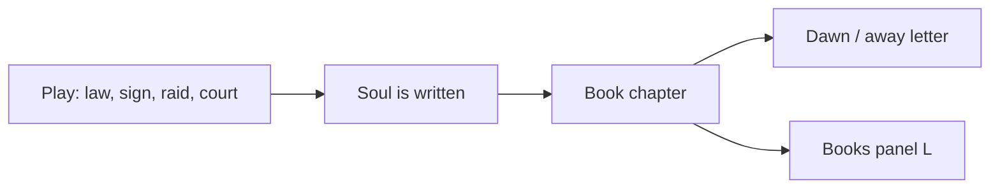

# The Book as Partner - Plan

## Goal Capsule

- **Objective:** When a named soul is written, the Book records a causal line with them. The Books list and the dawn letter tell that story. The player never types.
- **Product authority:** This slice only. Night-elects-the-law, strangers-read-the-tablet, and a household of five stay nearby candidates, not this contract.
- **Open blockers:** None.

## Product Contract

### Summary

Attach a because-clause at the moment a soul is inked. The Book reads as those lines. The dawn letter quotes the latest. No new panel. No player-authored canon.

### Problem Frame

The Book already stores named souls and letters already claim to quote it. What they quote is a kind: arrived, fallen, redeemed, mercy, exile. After a raid under a written curfew, the player still reads “The Book remembers Miriam, who fell.” The receipt is true and empty.

### Key Decisions

- **Read-only sift.** The player does not edit the Book. `(session-settled: user-directed — chosen over flyleaf / soul annotation / altar inscription: they want a truer story from what happened, not a writing tool.)` Governs R1, R6.
- **Both surfaces.** The Book holds the chapter; the letter quotes the latest line. `(session-settled: user-directed — chosen over letter-only, Books-only, or pass-by speech.)` Governs R4, R5.
- **Causal voice.** Lines take the shape “Because …, {name} {kind}.” `(session-settled: user-directed — chosen over parish register, letter-beat, or scriptural hush.)` Governs R2.
- **Cause on the ink.** The because-clause is written with the soul, not minted as a daily fortune. `(session-settled: user-directed — chosen over a dawn sentence or a rolling chapter.)` Governs R2, R3.
- **Book-as-partner first.** `(session-settled: user-approved — chosen over night-elects-the-law and strangers-read-the-tablet: memory can ship alone and gives those slices something to read.)`

### How This Work Fits Together

<!-- ce-section: work-relationships -->

This plan owns **causal Book lines**. The broader fun/freedom set in `docs/ideation/2026-09-13-valley-fun-freedom-ideation.html` is the current understanding, not a roadmap.

- Night elects the law — **Depends on** laws already mattering; **Can proceed independently of** this slice
- Strangers read the tablet — **Depends on** this Book having something true to read
- A household of five — **Shares** named souls; **Can proceed independently of** this slice
- Walk the sign / temptation that works — **Can proceed independently of** this slice

### Requirements

**Inking**

- R1. The player cannot write, edit, or strike a Book line.
- R2. When a soul is written, the entry includes a causal line in the voice “Because {cause}, {name} {what happened}.”
- R3. The cause is taken from what was actually in force or underway at that moment (a written law, an active sign, a raid or court act, open or closed gates). If none of those apply, use a smaller true line rather than inventing drama.

**Surfaces**

- R4. The Books panel (L) shows those causal lines as the readable Book, not kind-only receipts.
- R5. The dawn letter (and the away letter when it quotes the Book) uses the latest causal line.
- R6. No new HUD panel. Civic, Roster, and Quests do not become the Book.

**Tone and identity**

- R7. God remains voice and weather, never a unit. Causal lines do not put words in God’s mouth.
- R8. A quiet day that writes no new soul does not mint a fresh chapter. The letter may repeat the latest causal line or fall back to existing non-Book copy.

### Actors

- A1. **Player** — reads the Book and the letter; never authors them.
- A2. **The Book** — remembers named souls with cause.
- A3. **The letter** — quotes the latest Book line at dawn or on return.

### Key Flows

- F1. **A soul is inked.** **Trigger:** a villager arrives, falls, is redeemed, receives mercy or a fine, is exiled, or is lost. **Covers R2, R3.** The entry stores name, day, kind, and the causal line. The Books list updates immediately.
- F2. **Dawn or return.** **Trigger:** dawn report or an away letter that quotes the Book. **Covers R5, R8.** The letter uses the latest causal line if one exists; otherwise existing non-Book copy.
- F3. **Open the Book.** **Trigger:** player opens Books (L). **Covers R4, R1.** They can read the chapter. They cannot type.

### Acceptance Examples

- AE1. **Raid under curfew.** **When** Miriam falls during a night raid and a curfew law is written, **then** her Book line names the curfew and the raid, not only “fallen.” **Covers R2, R3.**
- AE2. **Mercy in court.** **When** the player shows mercy to Boaz, **then** his line names mercy and the court act. **Covers R2.**
- AE3. **Thin arrival.** **When** a stranger arrives with no sign, raid, or relevant law, **then** the line stays small and true (name and arrival), not a invented feud. **Covers R3.**
- AE4. **Letter quotes latest.** **When** two souls are written before dawn, **then** the dawn letter quotes the later causal line. **Covers R5.**
- AE5. **Quiet dawn.** **When** a day writes no new soul, **then** no new Book line appears, and the letter does not invent a chapter. **Covers R8.**
- AE6. **No quill.** **When** the player opens Books (L), **then** there is no field to edit a soul line. **Covers R1, R6.**

### Success Criteria

- After a night that cost a named soul, a player can retell *why* from the Book or the letter without opening Civic or the journal.
- The Book never reads as a virtue meter or as the voice of God.

### Scope Boundaries

**In**

- Causal lines on soul entries
- Books (L) and dawn/away letters

**Deferred for later**

- Player-edited flyleaf
- Night elects which law binds
- Recruits whose ask compiles from the Book
- Capping the living cast
- Villagers speaking Book lines on pass-by

**Outside this product's identity**

- God as a unit or speaker of Book lines
- A new HUD panel
- A second map or a rewritten `MAP_SEED`

### Dependencies / Assumptions

- Era 5 Judgment is present: `SoulEntry`, `recordSoul`, `quoteBook`, Books (L), letter Book copy.
- Existing `note` on a soul entry may carry the causal line. Planning decides the save bump if the stored shape changes.
- “Cause” uses facts the valley already knows. Planning chooses the exact binding order.

### Outstanding Questions

- Deferred to Planning: which in-force facts win when several apply (law vs sign vs raid).
- Deferred to Planning: whether a save version bump is required.

### Sources / Research

- `lib/valley/world/judgment.ts` — `SoulEntry`, `quoteBook`, `BOOK_CAP`
- `components/valley/books-panel.tsx` — read-only Book list
- `lib/valley/dialogue.ts` — `LETTER.storyBook` / `voiceBook`
- `docs/ideation/2026-09-13-valley-fun-freedom-ideation.html` — idea 1
- [WAWLT](https://mkremins.github.io/publications/WAWLT_ELO2020.pdf) — sift a transcript; this slice keeps the player off the quill
- [RimWorld apophenia](https://www.rockpapershotgun.com/how-rimworld-generates-great-stories) — two-line reasons beat kind labels
